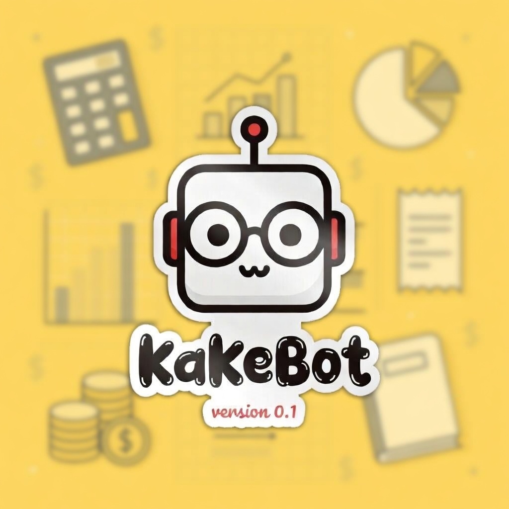

# KakeBot



KakeBot is a lightweight personal finance app inspired by the Japanese *kakebo* method.
It combines a Spring Boot backend, a future kawaii web frontend, and Telegram as a fast input channel for logging expenses.

## Project Goal

The goal of KakeBot is to make expense tracking simple, friendly, and consistent across web and Telegram.

Current product direction:

- Web registration and account management
- Telegram account linking through a temporary code
- Expense tracking and monthly summaries
- A future Tamagotchi-like visual dashboard

## Tech Stack

- Java 21
- Spring Boot 3
- Spring Data JPA
- MySQL
- Swagger / OpenAPI
- Telegram Bot API

## Current Backend Status

The backend already includes:

- User registration and login
- User profile endpoints (`register`, `login`, `me`, `update me`)
- Telegram link code generation
- Telegram webhook foundation
- Telegram account linking through `/link <code>`
- Expense creation
- Daily and monthly expense listing
- Daily and monthly totals
- Totals grouped by category
- Historical category totals by period
- Recent expenses and delete by id
- Global exception handling

## Architecture

This project follows a modular monolith approach with `package-by-feature` organization.

Main domains:

- `user`
- `expense`
- `telegram`
- `common`

Each domain keeps its own controllers, services, repositories, DTOs, mappers, and exceptions when needed.

## Telegram Flow

Current intended flow:

1. The user registers on the web app
2. The user generates a temporary Telegram link code
3. The user sends `/link <code>` to the bot
4. The backend links the Telegram account to the internal user
5. Telegram can later be used as a quick expense input channel

## Local Run

Create a `.env` file based on `.env.example` and define your database settings.

Expected environment variables:

```env
DB_URL=jdbc:mysql://localhost:3306/kakebot?useSSL=false&allowPublicKeyRetrieval=true&serverTimezone=UTC
DB_USERNAME=root
DB_PASSWORD=your_password
TELEGRAM_BOT_TOKEN=your_bot_token
```

Run locally with:

```bash
./mvnw spring-boot:run
```

Swagger UI:

```text
http://localhost:8080/swagger-ui/index.html
```

## Notes

- The frontend is planned after backend V1 is completed.
- Telegram integration is currently under active development.
- The repository documents architectural and learning decisions in `LEARNING_PACT.md`.

## License

This project is distributed under the license included in [LICENSE](/Users/jcasas87/IdeaProjects/kakebot/LICENSE).
